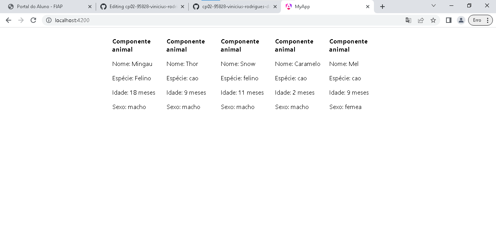

# Lista de animais

Este projeto foi gerado utilizando o [Angular CLI](https://github.com/angular/angular-cli) versão 17.3.5.

É preciso ter instalado em sua máquina, pelo menos a versão 18 do npm.

## Para executar o programa, os passos a seguir devem ser seguidos:

- Abrir o terminal de comando na pasta do projeto, no VS Code é possivel utilizar o comando Ctrl + ', para abrir o terminal embutido no editor de texto.
- Executar o comando "npm install" no terminal para instalar as dependências do projeto.
- Executar o comando "npm install --global @angular/cli" para instalar o suporte de linha de comando do angular.
- Executar o comando "ng serve -o" e então será aberto no seu navegador uma aba com a lista de animais.

## imagem do projeto funcionando

